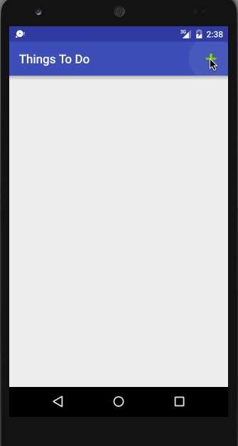

# ThingsToDo
List of things to do.
This app allows you to create list of task you need to get done, specify the due date and priority. It colors the items and date based on priority specified by user.

Submitted by: Nishit Shah

The following **required** functionality is completed:

* [x] User can **successfully add and remove items** from the todo list
* [x] User can **tap a todo item in the list and bring up an edit screen for the todo item** and then have any changes to the text reflected in the todo list.
* [x] User can **persist todo items** and retrieve them properly on app restart

The following **optional** features are implemented:

* [X] Persist the todo items [into SQLite](http://guides.codepath.com/android/Persisting-Data-to-the-Device#sqlite) instead of a text file
* [X] Improve style of the todo items in the list [using a custom adapter](http://guides.codepath.com/android/Using-an-ArrayAdapter-with-ListView)
* [X] Add support for completion due dates for todo items (and display within listview item)
* [X] Use a [DialogFragment](http://guides.codepath.com/android/Using-DialogFragment) instead of new Activity for editing items

The following **additional** features are implemented:

* [X] Added a "+" button to toolbar to add new items.
* [X] Added support for specifying priority for each item.
* [X] Each item is colored differently to indicate priority (Red = High, Green = Medium, Orange = Low)

Walkthrough of the App:

Editing an item using separate activity

Editing an item using Dialog

Completed app with due date and priority coloring

GIF created with [LiceCap](http://www.cockos.com/licecap/).
